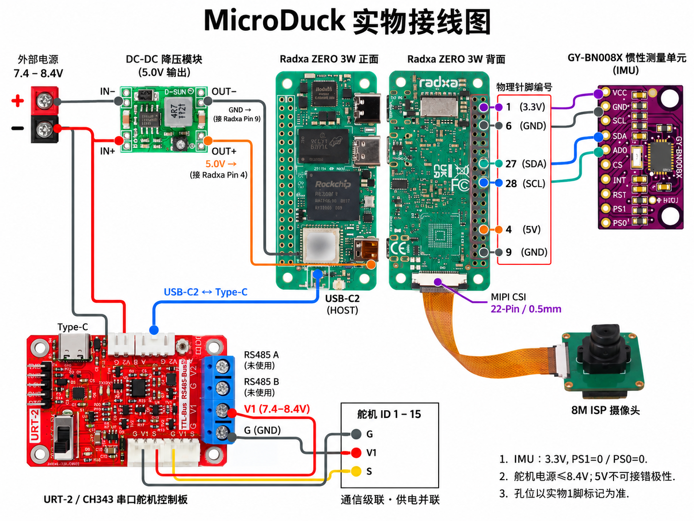
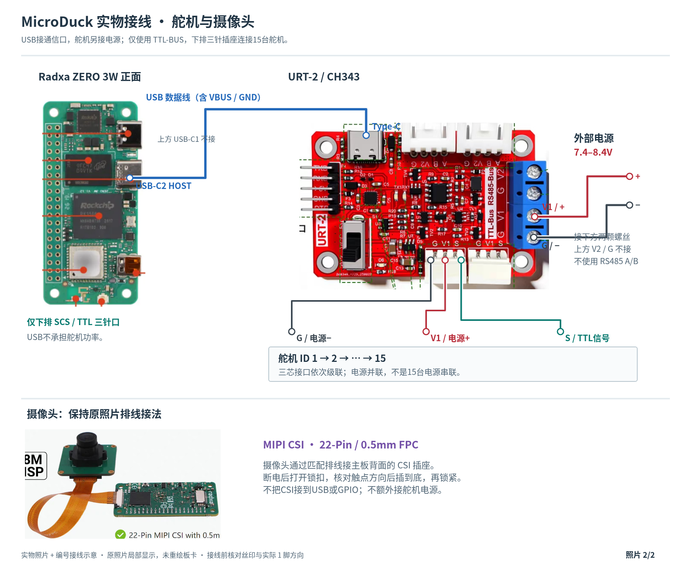
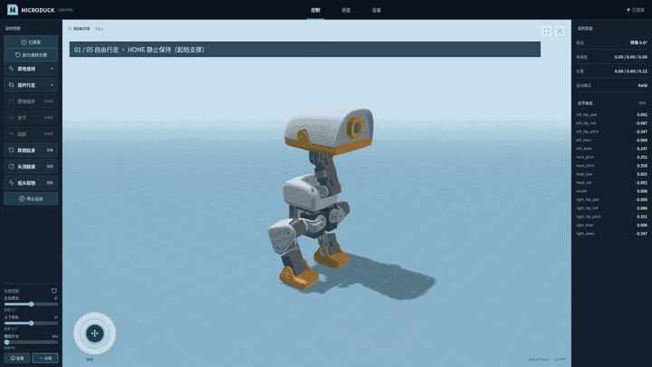
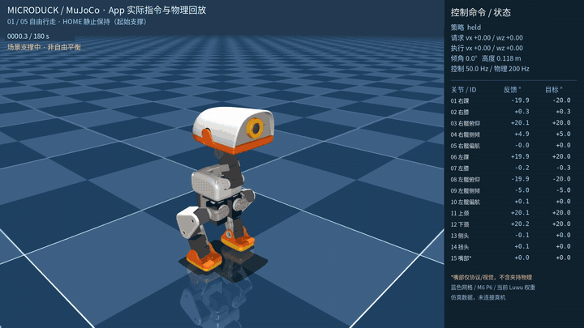

# MicroDuck HD1910M

Radxa ZERO 3W + 飞特 HD1910M ×15 + BNO08x。包含行走、拾取、起身、翻滚四模型适配、Rust 后端/底层、RL 训练与 MuJoCo 仿真源码；客户端只发布 APK，不包含 App 源码。

## 1. 接线


| 连接 | 接法 |
| --- | --- |
| IMU | Radxa 物理针脚 1→VCC、6→GND、27→SDA、28→SCL；3.3V、I²C4 |
| 舵机通信 | USB-C2 HOST → URT-2 Type-C；下排 SCS/TTL 三针口依次连接 15 路舵机 |
| 舵机供电 | 外部 7.4～8.4V → TTL-BUS 的 V1+/G−；不是上方 RS485 的 V2/G |
| 主板供电 | 外部电源经降压模块输出稳定 5V → 物理针脚 4，GND → 9；不要并联另一 USB 供电 |
| 摄像头 | 匹配的 22Pin/0.5mm 排线 → CSI；断电核对触点朝向 |

[实物 IMU/电源接线](docs/images/04_photo_imu_power.png) · [实物舵机/摄像头接线](docs/images/05_photo_usb_servo_camera.png)

电源并联供给各舵机，不是 15 台电源串联；接线以实物丝印为准。

**原始接线图（原文件保留）：此初稿存在端子连线错误，不可按其连线接电；实际接线以本节上方校正版和表格为准。**



**实物连接原图：**



## 2. 舵机编号


| ID | 关节 |
| --- | --- |
| 1 / 2 / 3 / 4 / 5 | 右踝 / 右膝 / 右髋俯仰 / 右髋侧倾 / 右髋偏航 |
| 6 / 7 / 8 / 9 / 10 | 左踝 / 左膝 / 左髋俯仰 / 左髋侧倾 / 左髋偏航 |
| 11 / 12 | 上颈 `head_pitch` / 下颈 `neck_pitch` |
| 13 / 14 / 15 | 侧头 `head_roll` / 转头 `head_yaw` / 嘴 |

以关节名称映射模型输出，不能把模型数组下标当作电机 ID。[展开动画下载](https://github.com/zhuoligetu123/microduck-hd1910m/releases/latest/download/microduck_exploded.gif)。

## 3. URDF 零位标定


按图对齐连杆和机身，再核对每个关节正方向。电机零位与模型 `q=0` 对齐，不能用“外壳长边水平/垂直”替代关节几何核对。

`q = direction × (ticks − zero_ticks) × 2π/4096`。示例映射在 [radxa/installation.json](radxa/installation.json)，仅供对照；部署使用本机实际标定文件，不覆盖已有校准，不自动写 EEPROM。嘴闭合为 0，张开为正。

## 4. HOME 站姿


**HOME 是模型站姿，不是舵机编码器零位。** 每个 ONNX 的 `default_joint_pos` 给出各自 HOME；输入关节位置使用 `q−HOME`，输出经本地 ID/方向/零位映射写给舵机。

App“使能”→平滑进入 HOME→静止保持；随后再选择行走/任务。停止保持当前姿态，卸力/清除告警另行触发。不得把 HOME 再校成硬件零位。

## 5. 演示与 APK

[观看 1080p 技术讲解](https://github.com/zhuoligetu123/microduck-hd1910m/releases/latest/download/microduck_explainer.mp4)：8 秒精彩片头、实物接线、舵机编号、零位与 HOME、BAM 说明及新的起身/翻滚仿真。

以下 GIF 可在 README 中直接播放，覆盖完整 180 秒视频，以 **5 倍速、约 36 秒**循环预览；点击动图观看正常速度的完整 MP4。

**App 操作与状态可视化**

[](https://github.com/zhuoligetu123/microduck-hd1910m/releases/latest/download/app_preview.mp4)

**MuJoCo 运动与关节状态**

[](https://github.com/zhuoligetu123/microduck-hd1910m/releases/latest/download/mujoco_preview.mp4)

[下载 APK](https://github.com/zhuoligetu123/microduck-hd1910m/releases/latest/download/microduck.apk) · [App 视频](https://github.com/zhuoligetu123/microduck-hd1910m/releases/latest/download/app_preview.mp4) · [MuJoCo 视频](https://github.com/zhuoligetu123/microduck-hd1910m/releases/latest/download/mujoco_preview.mp4)

APK 为当前 `com.microduck.control 0.1.2` 内部测试签名包；[ARM64 运行包](https://github.com/zhuoligetu123/microduck-hd1910m/releases/latest/download/microduck-hd1910m-arm64.tar.gz)包含编译后的底层、后端、模型与部署脚本。此次命名升级需要同时更新配置、底层、后端与 APK；不要混用旧版配置或客户端。

两个视频均为 **1920×1080、30fps、180秒**。前 112 秒保留方向与头嘴演示；后 68 秒替换为本轮 App 触发的独立仿真：前侧倒地起身后持续双脚站稳；头顶触地翻滚约 367°，随后切回零速度步态动态保持。动作中没有复位或外力辅助。翻滚并非双脚始终同时着地的静态站姿，其他倒地初态未全部通过，不能据此宣称实机或全工况验收。仍有直行偏航，拾取回稳待完善，嘴部仅显示动画。[本轮验证记录](docs/skill_validation.json)。

[起身 App 片段](https://github.com/zhuoligetu123/microduck-hd1910m/releases/latest/download/app_getup_verified.mp4) · [起身 MuJoCo 片段](https://github.com/zhuoligetu123/microduck-hd1910m/releases/latest/download/mujoco_getup_verified.mp4) · [翻滚 App 片段](https://github.com/zhuoligetu123/microduck-hd1910m/releases/latest/download/app_roll_verified.mp4) · [翻滚 MuJoCo 片段](https://github.com/zhuoligetu123/microduck-hd1910m/releases/latest/download/mujoco_roll_verified.mp4)

## 6. 编译、仿真与部署

Linux 环境：Rust ≥1.89、C/C++ 编译器、pkg-config；训练/仿真使用 Python 3.12 和 uv。硬件运行使用板端 Python venv 提供 ONNX Runtime 动态库。

```bash
git clone https://github.com/zhuoligetu123/microduck-hd1910m.git
cd microduck-hd1910m
python3 scripts/fetch_models.py                 # 固定来源版本并校验四个模型 SHA256
bash scripts/build.sh native                   # robotd、robotctl、Rust App 后端
cd microduck_rl
uv sync --locked
uv pip install websockets==15.0.1
cd ..
microduck_rl/.venv/bin/python scripts/build_sim.py
microduck_rl/.venv/bin/python scripts/run_sim.py --viewer --bind 0.0.0.0:38880
```

安装 APK，连接电脑的 `http://电脑IP:38880`，即可用 App 操作 MuJoCo。只有 API 后端，无浏览器版 App 源码。默认无令牌，**仅用于可信局域网，不要暴露到公网**。

Radxa 部署：

```bash
# Ubuntu Linux 上先安装交叉工具链
sudo apt install gcc-aarch64-linux-gnu g++-aarch64-linux-gnu
rustup target add aarch64-unknown-linux-gnu
bash scripts/build.sh arm64
python3 scripts/deploy.py --ip 192.168.43.3 --user robot
ssh robot@192.168.43.3
cd ~/workspace/microduck-hd1910m
python3 -m venv .venv
.venv/bin/pip install onnxruntime==1.24.4
# 必须使用该设备已核对的关节及 IMU 标定；不填 --allow-motion 为只读模式
python3 scripts/configure.py --calibration /绝对路径/installation.json --allow-motion
bash scripts/run_hardware.sh
```

先启用板端 I²C4，并确认运行用户有串口/I²C 权限。USB 串口使用稳定别名 `/dev/hd1910-servo`，也可用 `configure.py --port /dev/serial/by-id/...`。部署脚本只向新目录传输，不覆盖旧目录或标定；再次部署用 `--directory ~/workspace/新版本目录`。运行前显式停止旧控制服务，避免抢占硬件。本次 ARM64 包要求 glibc ≥2.35，适用于对应 Ubuntu 22.04/24.04 系统。

需要开机运行时，在旧服务停止后执行 `sudo bash scripts/install_service.sh`，再 `sudo systemctl start microduck-hd1910`；日志 `journalctl -u microduck-hd1910 -f`。开机启动程序不等于自动使能。

## 7. 模型与源码

模型目录：`radxa/references/reference_runtime_20261005/`。产品文件名统一为 `hd1910_*.onnx`；图参数、关节顺序、HOME 和 SHA256 保持不变。来源与许可单独保留在 [THIRD_PARTY.md](THIRD_PARTY.md) 和模型清单，不把改名当作重新训练。

权重仅做本地文件名调整，不改变来源或授权。第三方权重的再分发、商用权限需另行确认，详见来源说明；本次不更改仓库可见性。

| 文件 | 用途 | 状态 |
| --- | --- | --- |
| `hd1910_walk.onnx` | 前后行走、侧移、转向、头部控制 | 当前默认行走基线 |
| `hd1910_pick.onnx` | 拾取动作及嘴部阶段联动 | 实验功能，非抓取成功保证 |
| `hd1910_getup.onnx` | 倒地起身 | 前侧初态仿真通过，非全姿态保证 |
| `hd1910_roulade.onnx` | 头顶触地翻滚 | 本轮仿真完整旋转并动态落地保持 |

嘴部为独立第 15 路，不在 14 维 RL 动作内。此四模型不包含独立坐站、踢腿或踏步权重。

| 路径 | 内容 |
| --- | --- |
| `microduck/duck-control` | HD1910/BNO08x 接入、观测、ONNX 推理与底层 I/O |
| `microduck/robotd` | HOME/保持/行走/任务执行、JSON-RPC |
| `microduck_app/backend` | Rust HTTP/WebSocket、设备发现、App 控制适配 |
| `microduck_rl` | 训练环境、BAM M6、机器人几何、导出与回放源码 |
| `robot_description` | 三视图对应 URDF、网格和舵机编号数据，不含前端程序 |
| `radxa` | 本地 ID/零位适配、模型协议参考及部署配置 |
| `scripts` | 构建、获取模型、仿真和 SSH 部署 |

训练入口见 [RL 说明](docs/training.md)，许可和模型来源见 [THIRD_PARTY.md](THIRD_PARTY.md)。训练中间产物、设备凭据、App/Android 源码均不上传。
